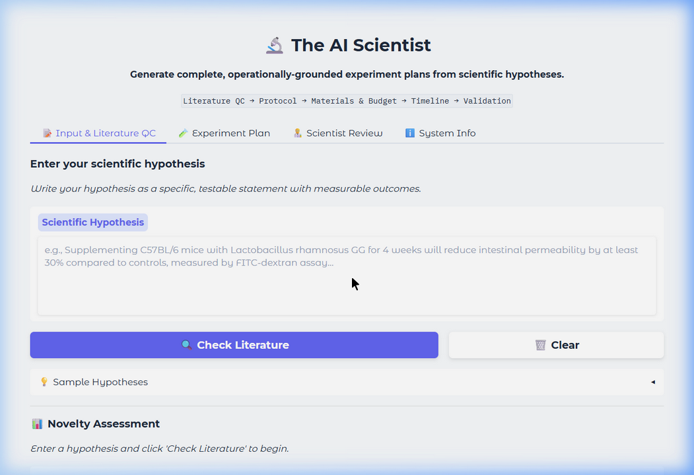
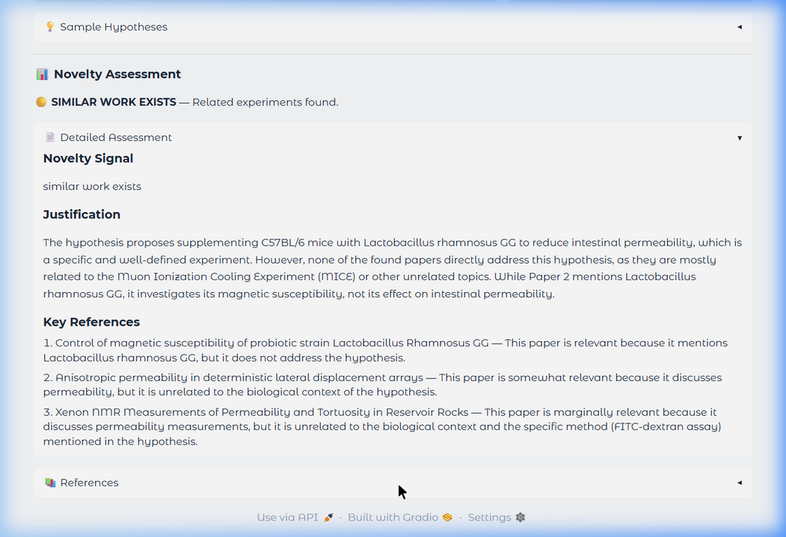

<](https://python.org)
[](https://gradio.app)
[](https://groq.com)
[](https://ai.google.dev)
[](LICENSE)

**Hack-Nation × World Bank Youth Summit · Global AI Hackathon 2026**

`Literature QC → Protocol → Materials & Budget → Timeline → Validation`

---



<br>



</div>

---

## ✨ Features

| Feature | Description |
|---------|-------------|
| 🔍 **Literature QC** | Searches ArXiv + Semantic Scholar to assess novelty of your hypothesis |
| 📋 **Protocol Generation** | Step-by-step methodology grounded in real published protocols |
| 🧫 **Materials & Supply Chain** | Specific reagents with catalog numbers from Thermo Fisher, Sigma-Aldrich, etc. |
| 💰 **Budget Estimation** | Realistic cost breakdowns with line items and grand totals |
| 📅 **Timeline Planning** | Phased project timelines with dependencies and milestones |
| ✅ **Validation Design** | Success criteria, statistical plans, controls, and sample sizes |
| 👨‍🔬 **Scientist Feedback Loop** | Structured review system that improves future plans via few-shot learning |
| 🔄 **Multi-LLM Fallback** | Groq → Gemini → OpenAI with automatic failover |

---

## 🏗️ Architecture

```
                    ┌─────────────────────────────────┐
                    │     User Input (Hypothesis)      │
                    └──────────────┬──────────────────┘
                                   │
                    ┌──────────────▼──────────────────┐
                    │       Literature QC Module       │
                    │  ┌──────────┐  ┌──────────────┐ │
                    │  │  ArXiv   │  │  Semantic     │ │
                    │  │  Search  │  │  Scholar      │ │
                    │  └──────────┘  └──────────────┘ │
                    │         Novelty Signal           │
                    │  🟢 not found │ 🟡 similar │ 🔴 exact │
                    └──────────────┬──────────────────┘
                                   │
                    ┌──────────────▼──────────────────┐
                    │     LLM Client (Multi-Provider)  │
                    │  Groq → Gemini → OpenAI          │
                    └──────────────┬──────────────────┘
                                   │
          ┌────────────┬───────────┼───────────┬────────────┐
          │            │           │           │            │
   ┌──────▼─────┐ ┌───▼────┐ ┌───▼────┐ ┌───▼─────┐ ┌───▼────────┐
   │  Protocol  │ │Material│ │ Budget │ │Timeline │ │ Validation │
   │  Generator │ │& Supply│ │Estimator│ │ Builder │ │  Designer  │
   └──────┬─────┘ └───┬────┘ └───┬────┘ └───┬─────┘ └───┬────────┘
          │            │          │           │           │
          └────────────┴──────────┼───────────┴───────────┘
                                  │
                    ┌─────────────▼───────────────────┐
                    │      Complete Experiment Plan     │
                    └─────────────┬───────────────────┘
                                  │
                    ┌─────────────▼───────────────────┐
                    │     Scientist Review & Feedback   │
                    │    (Closes the Learning Loop)     │
                    └─────────────────────────────────┘
```

---

## 📁 Project Structure

```
MIT Project/
│
├── main.py                          # 🚀 Entry point — launch the app
├── config.py                        # ⚙️  Centralized configuration (dataclasses)
├── app.py                           # 🖥️  Gradio UI — 4 tabs
├── requirements.txt                 # 📦 Dependencies
├── .env                             # 🔑 API keys (GROQ, GEMINI, OPENAI)
├── README.md                        # 📖 This file
│
├── llm/                             # 🧠 LLM Integration
│   ├── __init__.py
│   ├── llm_client.py                #    Unified multi-provider client
│   │                                #    (Groq → Gemini → OpenAI fallback)
│   └── prompts.py                   #    All prompt templates
│
├── literature/                      # 📚 Literature Search & Novelty Check
│   ├── __init__.py
│   ├── arxiv_search.py              #    ArXiv REST API client
│   ├── semantic_scholar.py          #    Semantic Scholar Graph API client
│   └── novelty_checker.py           #    Orchestrator — combines both sources
│
├── planner/                         # 🧪 Experiment Plan Generation
│   ├── __init__.py
│   ├── experiment_planner.py        #    Main orchestrator (single-shot / modular)
│   ├── protocol_generator.py        #    Step-by-step protocols
│   ├── materials_budget.py          #    Reagents + catalog #s + budget
│   ├── timeline_builder.py          #    Phased timelines with dependencies
│   └── validation_designer.py       #    Success criteria + statistical plan
│
├── feedback/                        # 🔄 Scientist Feedback Loop (Stretch Goal)
│   ├── __init__.py
│   ├── feedback_store.py            #    JSON-based correction storage
│   └── feedback_learner.py          #    Few-shot retrieval from past feedback
│
├── utils/                           # 🛠️  Utilities
│   ├── __init__.py
│   └── logger.py                    #    Loguru logging setup
│
├── data/                            # 💾 Runtime Data
│   ├── feedback/                    #    Stored scientist corrections (JSON)
│   └── ai_scientist.log             #    Application logs
│
└── docs/                            # 📸 Documentation
    ├── screenshot_main.png
    └── screenshot_results.png
```

---

## 🚀 Quick Start

### 1. Clone the repository

```bash
git clone <repository-url>
cd "MIT Project"
```

### 2. Install dependencies

```bash
pip install -r requirements.txt
```

### 3. Configure API keys

Copy `.env.example` to `.env`:

```bash
# Windows (PowerShell)
Copy-Item .env.example .env

# macOS/Linux
cp .env.example .env
```

Then edit `.env` with at least **one** LLM API key:

```env
# Groq (recommended — free, fast)
GROQ_API_KEY=your_key_here

# Google Gemini (free tier available)
GEMINI_API_KEY=your_key_here

# OpenAI (optional paid fallback)
OPENAI_API_KEY=your_key_here
```

> 💡 **Get free API keys:**
> - Groq: [console.groq.com](https://console.groq.com)
> - Gemini: [aistudio.google.com](https://aistudio.google.com)

### 4. Launch the app

```bash
python main.py
```

Open [http://localhost:7860](http://localhost:7860) in your browser.

#### CLI Options

| Flag | Description | Default |
|------|-------------|---------|
| `--port` | Server port | `7860` |
| `--share` | Create public Gradio link | `False` |
| `--debug` | Enable debug logging | `False` |

```bash
# Examples
python main.py --port 8080
python main.py --share          # Public URL for demo
python main.py --debug          # Verbose logging
```

---

## 🎯 How It Works

### Step 1: Enter Your Hypothesis

Write a specific, testable scientific hypothesis with measurable outcomes:

> *"Supplementing C57BL/6 mice with Lactobacillus rhamnosus GG for 4 weeks will reduce intestinal permeability by at least 30% compared to controls, measured by FITC-dextran assay, due to upregulation of tight junction proteins claudin-1 and occludin."*

### Step 2: Literature QC

The system searches **ArXiv** and **Semantic Scholar** simultaneously, then uses the LLM to compare your hypothesis against found papers:

| Signal | Meaning |
|--------|---------|
| 🟢 **Not Found** | No existing work matches — appears novel |
| 🟡 **Similar Work Exists** | Related experiments found but differ in key aspects |
| 🔴 **Exact Match Found** | This experiment has been published before |

### Step 3: Generate Experiment Plan

Choose a generation mode:

- **Single-shot** — One LLM call for the entire plan (faster)
- **Modular** — Separate calls per section (higher quality, 4 LLM calls)

The plan includes all 5 required sections:
1. **Protocol** — Step-by-step methodology with specific parameters
2. **Materials & Budget** — Reagents with real catalog numbers and costs
3. **Timeline** — Phased breakdown with dependencies
4. **Validation** — Statistical analysis plan and controls

### Step 4: Scientist Review *(Stretch Goal)*

Rate and correct each section. Your feedback is:
- Stored as structured JSON tagged by experiment type
- Retrieved as few-shot examples for future similar experiments
- **Every review makes the next plan better**

---

## 🧠 LLM Provider Strategy

The system uses a **cascading fallback** architecture:

```
Priority 1: Groq (LLaMA 3.3 70B Versatile)
    │         Fast inference, free tier
    │
    ├─ fails? ──▶ Priority 2: Google Gemini (2.0 Flash)
    │                          Free tier, high quality
    │
    └─ fails? ──▶ Priority 3: OpenAI (GPT-4o-mini)
                               Paid, highest quality
```

If all providers fail, the system returns a helpful error message guiding users to configure their API keys.

---

## 📊 Sample Inputs

These hypotheses from the challenge brief work well for testing:

<details>
<summary><b>🩺 Diagnostics</b></summary>

> A paper-based electrochemical biosensor functionalized with anti-CRP antibodies will detect C-reactive protein in whole blood at concentrations below 0.5 mg/L within 10 minutes, matching laboratory ELISA sensitivity without requiring sample preprocessing.

*In plain English: Can we build a cheap, fast blood test for inflammation that works without lab equipment?*
</details>

<details>
<summary><b>🦠 Gut Health</b></summary>

> Supplementing C57BL/6 mice with Lactobacillus rhamnosus GG for 4 weeks will reduce intestinal permeability by at least 30% compared to controls, measured by FITC-dextran assay, due to upregulation of tight junction proteins claudin-1 and occludin.

*In plain English: Does a specific probiotic measurably strengthen the gut lining in mice?*
</details>

<details>
<summary><b>🧬 Cell Biology</b></summary>

> Replacing sucrose with trehalose as a cryoprotectant in the freezing medium will increase post-thaw viability of HeLa cells by at least 15 percentage points compared to the standard DMSO protocol, due to trehalose's superior membrane stabilization at low temperatures.

*In plain English: Can we keep more cells alive when freezing them by swapping one preservative for another?*
</details>

<details>
<summary><b>🌍 Climate</b></summary>

> Introducing Sporomusa ovata into a bioelectrochemical system at a cathode potential of −400mV vs SHE will fix CO₂ into acetate at a rate of at least 150 mmol/L/day, outperforming current biocatalytic carbon capture benchmarks by at least 20%.

*In plain English: Can a specific microbe convert CO₂ into a useful chemical compound more efficiently than current methods?*
</details>

---

## 🔧 Configuration

All settings are managed via `config.py` using Python dataclasses:

| Config Class | Purpose |
|-------------|---------|
| `LLMConfig` | API keys, model names, temperature, max tokens |
| `LiteratureConfig` | ArXiv/S2 URLs, max results, similarity thresholds |
| `PlannerConfig` | Plan sections, currency settings |
| `FeedbackConfig` | Feedback directory, few-shot retrieval settings |
| `UIConfig` | Server name, port, Gradio theme |

---

## 📦 Dependencies

| Package | Purpose |
|---------|---------|
| `gradio` | Interactive web UI |
| `groq` | Groq LLM API (LLaMA 3.3 70B) |
| `google-genai` | Google Gemini API |
| `openai` | OpenAI API (optional) |
| `requests` | HTTP for ArXiv & Semantic Scholar |
| `python-dotenv` | Environment variable loading |
| `loguru` | Structured logging |

---

## 🔗 Data Sources

| Source | Type | API Key Required |
|--------|------|:----------------:|
| [ArXiv](https://arxiv.org) | Scientific preprints | ❌ |
| [Semantic Scholar](https://www.semanticscholar.org) | Academic papers + citations | ❌ |
| [protocols.io](https://protocols.io) | Protocol references (in LLM prompts) | ❌ |
| [Bio-protocol](https://bio-protocol.org) | Peer-reviewed protocols (in LLM prompts) | ❌ |

---

## 🏆 Challenge Context

This project was built for the **FULCRUM × Hack-Nation** challenge at the **Hack-Nation × World Bank Youth Summit Global AI Hackathon 2026**.

**The quality bar:**
> *Would a real scientist trust this plan enough to order the materials and start running it? That is the standard.*

---

## 📄 License

This project is open source under the [MIT License](LICENSE).

---

<div align="center">

**Built with ❤️ for the Global AI Hackathon 2026**

*The AI Scientist — Because every great experiment starts with a great plan.*

</div>
]]>
