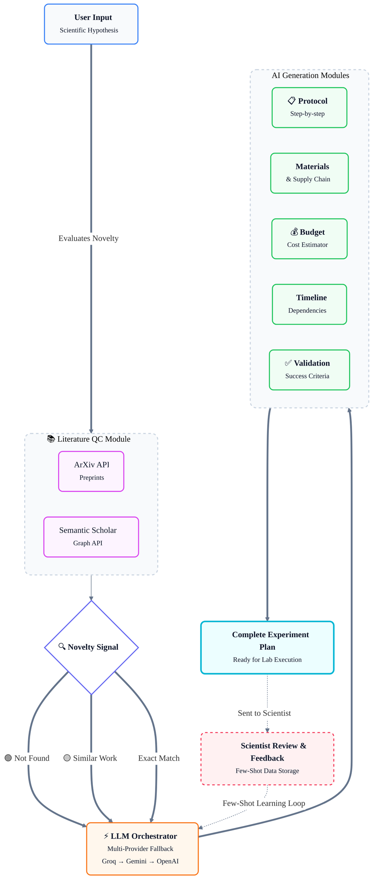

# System Architecture Visualization

Here is the beautiful, modern architecture diagram for **The AI Scientist** using Mermaid.js!

> [!TIP]
> This new Mermaid diagram has also been placed directly into your `README.md` to replace the old ASCII representation, providing an impressive and professional look when rendered on GitHub or any markdown viewer.
